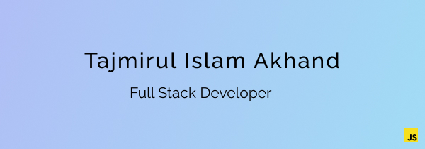

# Hi there, I'm Tajmirul Islam Akhand 👋

[](https://me.toinfinite.dev)
[](https://docs.google.com/document/d/18ua1EhwHHsHhaaJOlBXXLRu7cyzRP0oSx73tOVkTCaA/edit?usp=sharing)


## I'm a Full stack web developer

- ⚒️ Currently working on project (HISAB) that will reduce bachelor's problem
- 🔰 Learning Node Js, Next.js
- 🔭 Looking for new opportunity
- ❤️ Love to learn new technologies
- 🔮 My future plan is to start a unique business and take it to international level

## Some of my best work:

- Event Manager --> [Github](https://github.com/Tajmirul/event-management) | [Preview](https://event-manager-du.netlify.app)
  - HTML, CSS & SCSS, Tailwind CSS, jQuery
- Crenotive --> [Github](https://github.com/Tajmirul/crenotive) | [Preview](https://crenotive.netlify.app)
  - HTML, CSS & SCSS, Bootstrap 5, jQuery
- Next Blog --> [Github](https://github.com/Tajmirul/next-blog) | [Preview](https://next-blog-tajmirul.netlify.app)
  - React Js, Javascript, Contentful
- Ecolife (under development) --> [Github](https://github.com/Tajmirul/ecolife) | [Preview](https://ecolife.toinfinite.dev/)
  - Node Js, Express, MongoDB


## Skills and Tools:


<!--START_SECTION:waka-->

```text
From: 24 July 2022 - To: 31 July 2022

HTML             13 hrs 15 mins  ███████████████▒░░░░░░░░░   61.29 %
CSS              2 hrs 19 mins   ██▓░░░░░░░░░░░░░░░░░░░░░░   10.74 %
Blade Template   1 hr 24 mins    █▓░░░░░░░░░░░░░░░░░░░░░░░   06.52 %
JavaScript       1 hr 16 mins    █▒░░░░░░░░░░░░░░░░░░░░░░░   05.91 %
Markdown         1 hr 4 mins     █▒░░░░░░░░░░░░░░░░░░░░░░░   04.98 %
Other            55 mins         █░░░░░░░░░░░░░░░░░░░░░░░░   04.29 %
```

<!--END_SECTION:waka-->

## Connect with me:

[](mailto:tasmirolislam@gmail.com)
[](https://www.facebook.com/akhand.tajmirul)
[](https://www.linkedin.com/in/tajmirul)


<!--START_SECTION:activity-->

[website]: https://toinfinite.dev
[linkedin]: https://www.linkedin.com/in/tajmirul
