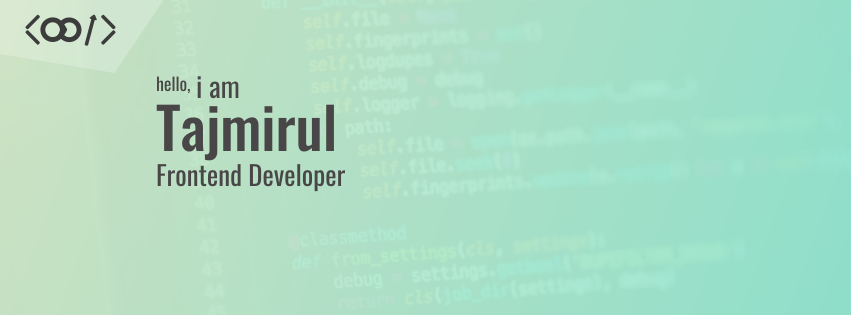

 <br><br>

# Hi there, I'm Tajmirul Islam Akhand 👋

[](https://me.toinfinite.dev)
[](https://docs.google.com/document/d/17vwbo5k84oMwpiV0V0JYY0UHRR_7uE0bOzQW2-oLMEI/edit?tab=t.0)

```bash
npx tajmirul    # to visit me in npm registry
```

## I'm a Frontend Developer

-   :tada: **First open source contribution [PR #1963 Quran.com](https://github.com/quran/quran.com-frontend-next/pull/1963)**
-   ⚒️ Currently working on a travel management website: ExpaTravels
-   🔰 Learning Nest.js and microservices
-   ❤️ Love to learn new technologies
-   🔮 My future plan is to start a business and take it to international level
<!-- -   🔭 Looking for new opportunity -->

## Skills and Tools:


<!--START_SECTION:waka-->

```txt
From: 26 May 2025 - To: 02 June 2025

JavaScript   15 hrs 50 mins  █████████████████░░░░░░░░   68.15 %
TypeScript   6 hrs 35 mins   ███████░░░░░░░░░░░░░░░░░░   28.36 %
Bash         27 mins         ▒░░░░░░░░░░░░░░░░░░░░░░░░   01.95 %
Other        11 mins         ▒░░░░░░░░░░░░░░░░░░░░░░░░   00.84 %
JSON         9 mins          ▒░░░░░░░░░░░░░░░░░░░░░░░░   00.69 %
```

<!--END_SECTION:waka-->

## Connect with me:

[](https://mail.google.com/mail/?view=cm&fs=1&to=tasmirolislam@gmail.com)
[](https://www.facebook.com/akhand.tajmirul)
[](https://www.linkedin.com/in/tajmirul)

<!--START_SECTION:activity-->

[website]: https://toinfinite.dev
[linkedin]: https://www.linkedin.com/in/tajmirul
