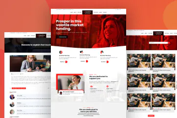
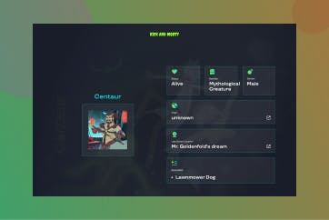
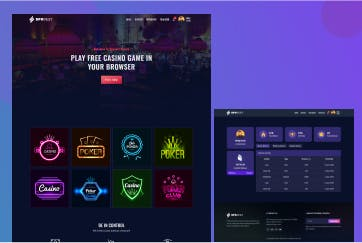

 <br><br>

# Hi there, I'm Tajmirul Islam Akhand 👋


[](https://docs.google.com/document/d/18ua1EhwHHsHhaaJOlBXXLRu7cyzRP0oSx73tOVkTCaA/edit?usp=sharing)

```bash
npx tajmirul
```

## I'm a Frontend Developer

-   :tada: **First open source contribution [PR #1963 Quran.com](https://github.com/quran/quran.com-frontend-next/pull/1963)**
-   ⚒️ Currently working on an accounting app [AnchorBooks](https://anchorbooks.ai/)
-   🔰 Learning Nest.js
-   ❤️ Love to learn new technologies
-   🔮 My future plan is to start a business and take it to international level
<!-- - 🔭 Looking for new opportunity -->

## Some of my best work:

<div
            style="
                max-width: 700px;
                display: flex;
                flex-direction: column;
                gap: 20px;
            "
        >
            <div style="display: flex; gap: 30px">
                <div>
                    
                </div>
                <div>
                    <h4 style="font-size: 18px; margin: 0">Crenotive</h4>
                    <small style="font-size: 10px"
                        >HTML, CSS & SCSS, Javascript & jQuery</small
                    >
                    <div style="display: flex; gap: 10px">
                        <a href="" style="font-size: 13px">Github</a>
                        <a href="" style="font-size: 13px">Live Preview</a>
                    </div>
                    <p style="margin-top: 7px">
                        Creative, eye-catching, and responsive website that is
                        perfect for a business. It contains multiple pages.
                    </p>
                </div>
            </div>
            <div style="display: flex; gap: 30px">
                <div>
                    
                </div>
                <div>
                    <h4 style="font-size: 18px; margin: 0">
                        Top Coder Competition
                    </h4>
                    <small style="font-size: 10px"
                        >TypeScript, React Js, Tailwind Css</small
                    >
                    <div style="display: flex; gap: 10px">
                        <a href="" style="font-size: 13px">Github</a>
                        <a href="" style="font-size: 13px">Live Preview</a>
                    </div>
                    <p style="margin-top: 7px">
                        Explore the world of "Rick and Morty" with this dynamic
                        fan website built with React and Tailwind CSS
                    </p>
                </div>
            </div>
            <div style="display: flex; gap: 30px">
                <div>
                    
                </div>
                <div>
                    <h4 style="font-size: 18px; margin: 0">
                        Unveiling BitBetio
                    </h4>
                    <small style="font-size: 10px"
                        >Tailwind CSS, Html, JavaScript</small
                    >
                    <div style="display: flex; gap: 10px">
                        <a href="" style="font-size: 13px">Github</a>
                        <a href="" style="font-size: 13px">Live Preview</a>
                    </div>
                    <p style="margin-top: 7px">
                        Experience the thrill of online betting with BitBetio -
                        a secure platform offering a wide range of exciting
                        games, easy deposits and withdrawals
                    </p>
                </div>
            </div>
        </div>

[<font size="3">**View More**</font>](https://me.toinfinite.dev/projects)

## Skills and Tools:


<!--START_SECTION:waka-->

```text
From: 30 July 2022 - To: 06 August 2022

JavaScript       13 hrs 12 mins  ██████████░░░░░░░░░░░░░░░   39.54 %
HTML             12 hrs 16 mins  █████████▒░░░░░░░░░░░░░░░   36.74 %
Blade Template   2 hrs 44 mins   ██░░░░░░░░░░░░░░░░░░░░░░░   08.20 %
CSS              1 hr 51 mins    █▒░░░░░░░░░░░░░░░░░░░░░░░   05.57 %
YAML             1 hr            ▓░░░░░░░░░░░░░░░░░░░░░░░░   03.04 %
Other            54 mins         ▓░░░░░░░░░░░░░░░░░░░░░░░░   02.72 %
```

<!--END_SECTION:waka-->

## Connect with me:

[](mailto:tasmirolislam@gmail.com)
[](https://www.facebook.com/akhand.tajmirul)
[](https://www.linkedin.com/in/tajmirul)

<!--START_SECTION:activity-->

[website]: https://toinfinite.dev
[linkedin]: https://www.linkedin.com/in/tajmirul
